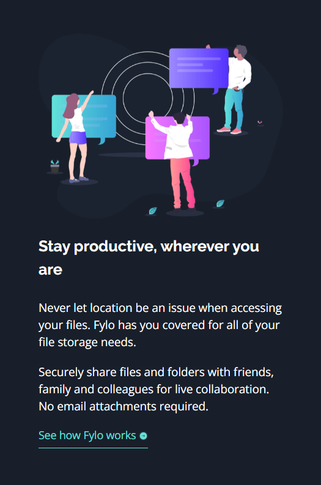

# Frontend Mentor - Fylo Dark Theme Landing Page solution with React and Typescript ⚛️✅


This is a solution to the **[Fylo Dark Theme Landing Page challenge on Frontend Mentor](https://www.frontendmentor.io/challenges/fylo-dark-theme-landing-page-5ca5f2d21e82137ec91a50fd)** by **[Dacardonac](https://github.com/Dacardonac)**. Frontend Mentor challenges help you improve your coding skills by building realistic projects with Frontend.

## Table of contents 📄

- **Frontend Mentor - Fylo Dark Theme Landing Page**
  - **[Table of contents](#table-of-contents-)**
  - **[Overview](#overview-)**
    - [The challenge](#the-challenge-)
    - [Screenshot](#screenshots-)
    - [Links](#links-)
    - [How to use](#how-to-use-the-project-)
  - **[My process](#my-process-)**
    - [Built with](#built-with-)
    - [What I learned](#what-i-learned-)
    - [Continued development](#continued-development-)
    - [Useful resources](#useful-resources-)
  - **[Author](#author-)**
  - **[Acknowledgments](#acknowledgments-)**
  - **[Contributing](#contributing-)**

## Overview ⬇️

### The challenge 🧩

**Users should be able to see in this project:**

- View the optimal layout depending on their device's screen size only between mobile and desktop (Responsive)
- Styles in Components and modules (Sass/Scss)
- React Components
- Accessibility (a11y)
- BEM Methodology
- Typecript

### Screenshots 📷

Desktop 🖥️

****

Mobile 🤳

****
#
### Links 📍

- Solution URL: **[Frontend Mentor Solution 👨‍💻]()**
- Live Site URL: **[Solution Deploy in Vercel 🚀]()**
- LinkedIn: **[Solution Post in LinkedIn 💻]()**
- Challenge: **[Frontend Mentor Challenge 🧩](https://www.frontendmentor.io/challenges/fylo-dark-theme-landing-page-5ca5f2d21e82137ec91a50fd)**
#
### How to Use the Project 💻

To use this project, you need to follow these steps:

1. **Clone the repository**:

  ```bash
  git clone https://github.com/Dacardonac/fem-fylo-dark-theme-landing-page.git
  ```

2. **Navigate to the project directory 📂**:

  ```bash
  cd fem-fylo-dark-theme-landing-page
  ```

3. **Install dependencies ⬇️: Make sure you have Node.js installed, then run**:

  ```bash
  npm install

  # or if you prefer Yarn

  yarn install
  ```

4. **Run the project ▶️: Start the development server with**:

  ```bash
  npm run dev
  ```
  This will start the project locally, typically accessible at `http://localhost:5173`.

5. **If you want to see a preview of the project ▶️**:

  ```bash
  npm run build
  npm run preview
  ```
  **This will start the Preview server on `http://localhost:5174`.**

## My process 🎓

### Built with 🛠

- HTML5 - Structure
- CSS3 Custom Properties - Styles
- React TSX - Programming Logic and Components
- Mobile-first Workflow
- Flexbox - Spaces and Alignments
- Conventional Commits - Commit Specification
- [Vite](https://vitejs.dev/) - Frontend Tooling
- [Sass/Scss](https://sass-lang.com/) - Modules and Styles
- Markdown - README.md and LICENSE files (Documentation)
- BEM Methodology
- [TypeScript](https://www.typescriptlang.org/)
#
### What I learned 🧠

With this project, I learned, implemented, and practiced **React - TSX**, along with its properties and methods like **Props**, **Components** and **Functions**. I also reinforced and practiced my **CSS3** knowledge with **Sass/Scss modules**, worked on semantic **HTML5** by applying the **BEM** methodology for class naming and **Componets**.

**You can see an example below ⬇️:**

``` JSX
import Button from './button/Button';
import Cards from './cards/Cards';
import Info from './info/Info';
import m from './Main.module.scss';
import infoData from '../../data/infoData.json';
import Form from './form/Form';

const Main = () => {
  return (
    <main className={m.main}>
      <header>
        <figure className={m['main__figure']}>
          
        </figure>
        <div className={m['main__content']}>
          <h1 className={m['main__title']}>
            All your files in one secure location, accessible anywhere.
          </h1>
          <p className={m['main__paragraph']}>
            Fylo stores all your most important files in one secure location.
            Access them wherever you need, share and collaborate with friends
            family, and co-workers.
          </p>
          <Button
            title="Get Started"
            width="240px"
          />
        </div>
      </header>
      <section
        aria-label="Features"
        className={m['main__features']}
      >
        {infoData.map((item, idx) => (
          <Info
            key={idx}
            imgSrc={item.imgSrc}
            imgAlt={item.imgAlt}
            title={item.title}
            paragraph={item.paragraph}
          />
        ))}
      </section>
```
#
```scss
.main {
  display: flex;
  flex-direction: column;
  align-items: center;
  // background-color: var(--navy-900);

  &__figure {
    margin: 0 0 2.06rem 0;
    width: 19rem;
    height: 14.06rem;
    display: flex;
    justify-content: center;
    align-items: center;

    &-img {
      width: 100%;
      height: auto;
      display: block;
    }
  }

  &__content {
    display: flex;
    flex-direction: column;
    justify-content: center;
    align-items:  center ;
  }

  &__title {
    font-family: "Raleway", sans-serif;
    font-size: 1.5rem;
    font-weight: bold;
    line-height: 2.25rem;
    text-align: center;
    margin: 0 0 0.94rem 0;
    max-width: 20rem;
  }

  &__paragraph {
    font-family: "Open Sans", sans-serif;
    font-size: 0.875rem;
    font-weight: 400;
    line-height: 1.3125rem;
    text-align: center;
    margin: 0 0 2rem 0;
    max-width: 18.5rem;
  }

  &__features {
    display: flex;
    flex-direction: column;
    align-items: center;
    justify-content: center;
    text-align: center;
    gap: 5rem;
    margin-bottom: 10rem;
  }
  ...
}
```
#
### Continued development 🔎

I want to continue learning more about **React**, **Props** and **Typescript**, **Responsive Design** and how to work across different devices with **Flexbox**, **Grid** and **@media**, also I want continue using  **BEM methodology** and perfect the technique in aspects like name the classes and components, also I want to improve in modularize the components styles and classes with **Sass modules**, learn about **Conventional Commits**, keep using **Vite** and continue using **Config files** and **AI**.

### Useful resources 🛠

- **[MDN](https://developer.mozilla.org/en-US/)** - This helped me with **Documentation** on many topics, mostly with **HTML** and **CSS** properties.
- **[ChatGPT](https://chatgpt.com/)** - This is an incredible **Artificial Intelligence (AI)** tool, **ChatGPT** helps me with **specific topics**, **errors in the project** and **investigations**.
- **[Figma](https://www.figma.com/)** - Amazing tool for the **design** and style of the project.
 - **[FontAwesome](https://fontawesome.com/)** - Social icons for the footer and navbar were downloaded from FontAwesome.

## Author 👨‍💻

- Frontend Mentor - **[@Dacardonac](https://www.frontendmentor.io/profile/Dacardonac)**
- LinkedIn - **[@Daniel Alejandro Cano Cardona](https://www.linkedin.com/in/daniel-alejandro-cano-cardona/)**

## Acknowledgments 🙌

I want to thank **[Jairovg](https://github.com/jairovg)** for the teachings and his help to complete this challenge in a good way and with good practices.

## 🤝 Contributing

Thank you for your interest in contributing to this project! Any kind of help is welcome — fixing bugs, improving the design, optimizing code, or sharing new ideas.

### How to Contribute 🧑‍💻

1. **Fork this repository**

2. **Create a new branch for your feature or fix**

```bash
git checkout -b feature/your-feature-name
```
3. **Make your changes and commit with clear, conventional messages**

```bash
git commit -m "feat: add notification component"
```

4. **Push your branch**

```bash
git push origin feature/your-feature-name
```

5. **Open a Pull Request (PR) from your fork to the main branch of this repository.**
#
### Contribution Guidelines 📌

- Follow the project's best practices (BEM, modular structure, naming conventions).

- Keep consistency with existing styles and code.

- Use Conventional Commits.

- Make sure the project runs correctly before submitting your PR (npm run dev and npm run preview).
#
**thank you frontend mentor for promoting learning and providing knowledge with these challenges** 🙌

**Have fun building!** 🚀
#
